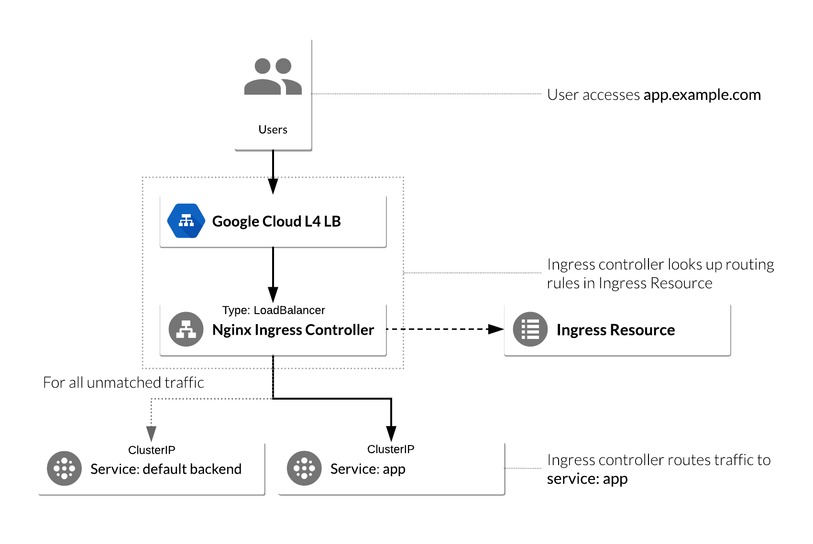

#NGINX Ingress Controller on Google Kubernetes Engine


## Set your GCP project

You can use an existing Google Cloud Platform project for this tutorial, or you can [create a project](https://cloud.google.com/resource-manager/docs/creating-managing-projects#creating_a_project).

Open the terminal/cloud console and follow the steps below:

### 1. Set environment variables
In the terminal, set your `PROJECT_ID` variable if you don't already have them configured.

```bash
PROJECT_ID=my-project
```
Replace `my-project` with your [project id](https://support.google.com/cloud/answer/6158840).

### 2. Run the following command to see a list of [Google Cloud zones](https://cloud.google.com/compute/docs/regions-zones/).

```bash
gcloud compute zones list
```
### 3. Now run the following command to set your zone

```bash
gcloud config set compute/zone <pass zone here>
```
example: gcloud config set compute/zone us-west1-a

## Create a Kubernetes cluster

### 1. Run the following command to create a cluster named nginx-tutorial that's made up of two nodes (or worker machines)

```bash
gcloud container clusters create nginx-tutorial \
  --machine-type e2-small \
  --num-nodes 2
```
it will take few minutes to complete

## Install Helm

### 1. Add the chart repository

```bash
helm repo add nginx-stable https://helm.nginx.com/stable
```
### 2. Update the repo

```bash
helm repo update
```

## Deploy an application in Kubernetes Engine
Now that you have Helm configured, deploy a simple web-based application from the Google Cloud Repository.
This application will be used as the backend for the Ingress.

### 1. From the Cloud Shell, run the following command

```bash
kubectl create deployment hello-app --image=gcr.io/google-samples/hello-app:1.0
```
Your output should resemble the following

```
deployment.apps/hello-app created
```
### 2. Now expose the hello-app Deployment as a Service by running the following command

```bash
kubectl expose deployment hello-app  --port=8080
```
Your output should resemble the following:

```
service/hello-app exposed
```

## Deploying the NGINX Ingress controller via Helm 

The Kubernetes platform gives administrators flexibility when it comes to Ingress Controllers—you can integrate your own rather than having to work with your provider's built-in offering. The NGINX controller must be exposed for external access. This is done using Service type: LoadBalancer on the NGINX controller service. On Kubernetes Engine, this creates a Google Cloud Network (TCP/IP) Load Balancer with NGINX controller Service as a backend. Google Cloud also creates the appropriate firewall rules within the Service's VPC to allow web HTTP(S) traffic to the load balancer frontend IP address.
y
### NGINX Ingress controller on Kubernetes Engine
The following flowchart is a visual representation of how an NGINX controller runs on a Kubernetes Engine cluster:




### 1. Now that we have the bigger picture in mind, we can deploy the NGINX Ingress Controller. Use following command

```bash
helm install nginx-ingress nginx-stable/nginx-ingress --set rbac.create=true
```
Note: Please ignore if any deprecation warning.
Wait a few moments while the Google Cloud L4 Load Balancer gets deployed.

### 2. Confirm that the nginx-ingress-nginx-ingress Service has been deployed and that you have an external IP address associated with the service by running the following command

```bash
kubectl get service nginx-ingress-nginx-ingress
```

Output will be like this

```
NAME                          TYPE           CLUSTER-IP     EXTERNAL-IP      
nginx-ingress-nginx-ingress   LoadBalancer   10.7.248.226   35.226.162.176   
```

## Configure Ingress Resource to use NGINX Ingress Controller
An Ingress Resource object is a collection of L7 rules for routing inbound traffic to Kubernetes Services. Multiple rules can be defined in one Ingress Resource or they can be split up into multiple Ingress Resource manifests. The Ingress Resource also determines which controller to utilize to serve traffic. This can be set with an annotation, kubernetes.io/ingress.class, in the metadata section of the Ingress Resource.

### 1. For the NGINX controller, you will use the nginx value as shown below

```
annotations: kubernetes.io/ingress.class: nginx
```
### 2. On Kubernetes Engine, if no annotation is defined under the metadata section, the Ingress Resource uses the Google Cloud GCLB L7 load balancer to serve traffic. This method can also be forced by setting the annotation's value to gce, like below:

```
annotations: kubernetes.io/ingress.class: gce
```

### 3. Lets create an ingress resource file and Add the following content in ingress-resource.yaml file

```
vi ingress-resource.yaml

apiVersion: networking.k8s.io/v1
kind: Ingress
metadata:
  name: ingress-resource
  annotations:
    kubernetes.io/ingress.class: nginx
    nginx.ingress.kubernetes.io/ssl-redirect: "false"
spec:
  rules:
  - host: $NGINX_INGRESS_CONTROLLER_IP.nip.io
    http:
      paths:
      - path: /hello
        pathType: Prefix
        backend:
          service:
            name: hello-app
            port:
              number: 8080

```

### 4. Get your NGINX Ingress Controller IP and store it in an environment variable

export NGINX_INGRESS_CONTROLLER_IP=$(kubectl get services nginx-ingress-nginx-ingress --output jsonpath='{.status.loadBalancer.ingress[0].ip}')
echo $NGINX_INGRESS_CONTROLLER_IP


### 5. Add that ip to ingress-resource.yaml 

```bash
envsubst '$NGINX_INGRESS_CONTROLLER_IP' < ingress-resource.yaml | tee ingress-resource.yaml
```

### 6. Run the following command to apply our Ingress rules to Kubernetes application

```
kubectl apply -f ingress-resource.yaml
```

### 7. Verify that Ingress Resource has been created

```bash
kubectl get ingress ingress-resource
```

Looks like this

```
NAME               HOSTS     ADDRESS   PORTS     AGE
ingress-resource   *                   80        
```

## Test Ingress and default backend

### 1. Open a new tab and go to the following, replacing the [EXTERNAL-IP] with the external IP address of the NGINX ingress controller

```bash
http://[EXTERNAL-IP].nip.io/hello
```

It will look like this


