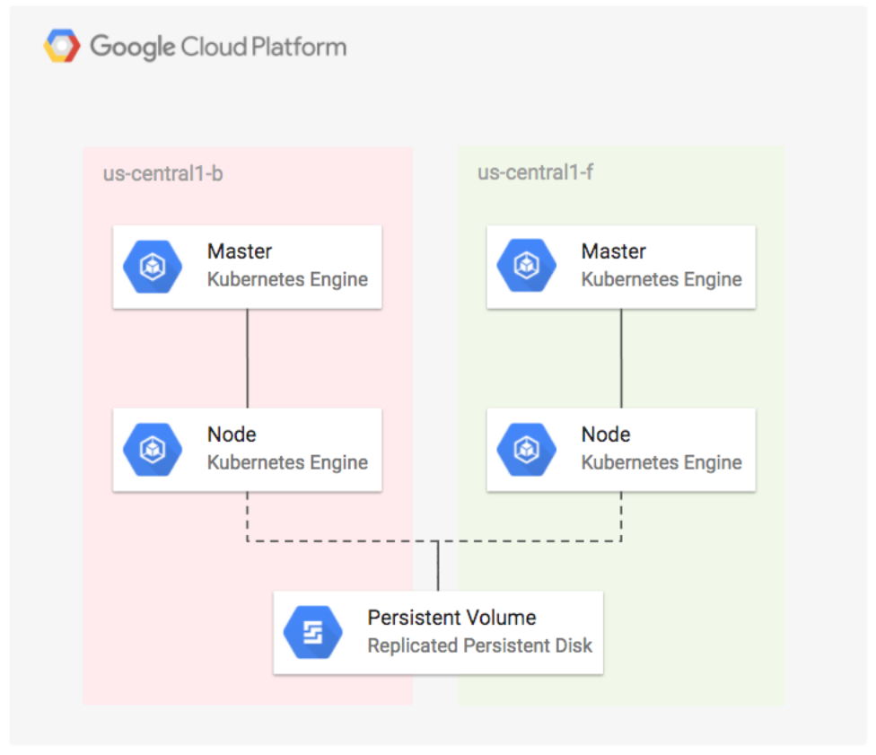

#Using Kubernetes Engine to Deploy Apps with Regional Persistent Disks



## Set your GCP project

You can use an existing Google Cloud Platform project for this tutorial, or you can [create a project](https://cloud.google.com/resource-manager/docs/creating-managing-projects#creating_a_project).

Open the terminal/cloud console and follow the steps below:

### 1. Set environment variables
In the terminal, set your `PROJECT_ID` variable if you don't already have them configured.

```bash
PROJECT_ID=my-project
```
Replace `my-project` with your [project id](https://support.google.com/cloud/answer/6158840).

## Creating the Regional Kubernetes Engine Cluster

Open a new Cloud Shell session.
### 1. Now set `CLOUDSDK_CONTAINER_USE_V1_API_CLIENT` for the sdk version

```bash
export CLOUDSDK_CONTAINER_USE_V1_API_CLIENT=false
```

### 2. Create a regional Cluster

```bash
gcloud container clusters create repd \
  --machine-type=n1-standard-1 \
  --region=us-central1 \
  --num-nodes=1
```
Example output:

```
Creating cluster repd...done.
Created [https://container.googleapis.com/v1beta1/projects/qwiklabs-gcp-e8f5f22705c770ab/zones/us-central1/clusters/repd].
To inspect the contents of your cluster, go to: https://console.cloud.google.com/kubernetes/workload_/gcloud/us-central1/repd?project=qwiklabs-gcp-e8f5f22705c770ab
kubeconfig entry generated for repd.
NAME  LOCATION     MASTER_VERSION     MASTER_IP      MACHINE_TYPE   NODE_VERSION     NUM_NODES  STATUS
repd  us-central1  1.23.6-gke.1700    35.247.50.133  n1-standard-1  1.23.6-gke.1700  3          RUNNING
```

## Deploying the App with a Regional Disk

### 1. Add the stable chart repository

```bash
helm repo add stable https://charts.helm.sh/stable
```

### 2. Update the repo

```bash
helm repo update
```

## Creating the StorageClass
Now we will create storage class which we can then attach to a Persistent Volume Claim and then we 
attach that PVC to wordpress 

### 1. Create a StorageClass for the regional disk by running

```bash
kubectl apply -f - <<EOF
kind: StorageClass
apiVersion: storage.k8s.io/v1
metadata:
  name: repd-central1-a-b-c
provisioner: kubernetes.io/gce-pd
parameters:
  type: pd-standard
  replication-type: regional-pd
EOF
```
### 2. List the available storageclass with

```bash
kubectl get storageclass
```

## Create Persistent Volume Claims

### 1. Create data-wp-repd-mariadb-0 PVC with standard storageclass

```bash
kubectl apply -f - <<EOF
kind: PersistentVolumeClaim
apiVersion: v1
metadata:
  name: data-wp-repd-mariadb-0
  namespace: default
  labels:
    app: mariadb
    component: master
    release: wp-repd
spec:
  accessModes:
    - ReadWriteOnce
  resources:
    requests:
      storage: 8Gi
  storageClassName: standard
EOF
```

### 2. Create wp-repd-wordpress PVC with repd-central1-a-b-c storageClassName

```bash
kubectl apply -f - <<EOF
kind: PersistentVolumeClaim
apiVersion: v1
metadata:
  name: wp-repd-wordpress
  namespace: default
  labels:
    app: wp-repd-wordpress
    chart: wordpress-5.7.1
    heritage: Tiller
    release: wp-repd
spec:
  accessModes:
    - ReadWriteOnce
  resources:
    requests:
      storage: 200Gi
  storageClassName: repd-central1-a-b-c
EOF
```

### 3. List the available persistentvolumeclaims with

```bash
kubectl get pvc
```

## Deploy WordPress

### 1. Deploy the WordPress chart that is configured to use the StorageClass that we created earlier

```bash
helm install wp-repd \
  --set smtpHost= --set smtpPort= --set smtpUser= \
  --set smtpPassword= --set smtpUsername= --set smtpProtocol= \
  --set persistence.storageClass=repd-central1-a-b-c \
  --set persistence.existingClaim=wp-repd-wordpress \
  --set persistence.accessMode=ReadOnlyMany \
  stable/wordpress
```

### 2. List out available wordpress pods

```bash
kubectl get pods
```
Make sure that pods are running before we move ahead

```
NAME                                 READY     STATUS    RESTARTS   AGE
wp-repd-mariadb-79444cd49b-lx8jq     1/1       Running   0          35m
wp-repd-wordpress-7654c85b66-gz6nd   1/1       Running   0          35m  
```
### 3. Run the following command which waits for the service load balancer's external IP address to be Created
Basically we are trying to get lb IP (`kubectl get svc wp-repd-wordpress -o jsonpath='{.status.loadBalancer.ingress[].ip}'`) 
but we will wait till its available and then save it in `SERVICE_IP` variable

```bash
while [[ -z $SERVICE_IP ]]; do SERVICE_IP=$(kubectl get svc wp-repd-wordpress -o jsonpath='{.status.loadBalancer.ingress[].ip}'); echo "Waiting for service external IP..."; sleep 2; done; echo http://$SERVICE_IP/admin
```

### 4. Verify that the persistent disk was created
Now we wait for PV to be created `kubectl get pvc wp-repd-wordpress -o jsonpath='{.spec.volumeName}'`
and then we save it in `PV` variable
and then we describe to get details

```bash
while [[ -z $PV ]]; do PV=$(kubectl get pvc wp-repd-wordpress -o jsonpath='{.spec.volumeName}'); echo "Waiting for PV..."; sleep 2; done
kubectl describe pv $PV
```

### 5. Get the URL for the WordPress admin page

```bash
echo http://$SERVICE_IP/admin
```
### 6. Open the wordpress URL in browser

### 7. Back in Cloud Shell, get a username and password so you can log in to the app

We are basically getting user and then password for wordpress from kubernetes secrets

```bash
cat - <<EOF
Username: user
Password: $(kubectl get secret --namespace default wp-repd-wordpress -o jsonpath="{.data.wordpress-password}" | base64 --decode)
EOF
```
### 8. Go to the WordPress tab and log in with the username and password that was returned

Use this to login to wordpress and now we have used persistent disk backed in three zones in a region with wordpress
